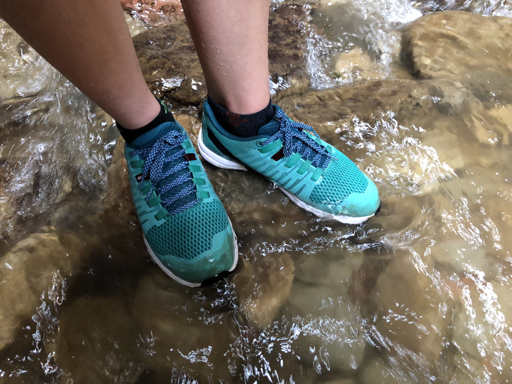

# Inov-8 Roclite 290 Review
My first all-around trail shoe.

I ran pretty flat trails a lot a year ago in road shoes and if it's wet or muddy used my **Invo-8 X-Talon 212**. However, the Roclite was my first all-around trail shoe.

## First impressions

Pretty great looking shoe. I've been a fan of Invo-8 as a brand but many of their shoes don't have that sleek, modern look of most of my road shoes. The **Roclite 290** has that classic Inov-8 look but captures the modern shoe clean design as well.

Much more of a road shoe fit, with a surprisingly spacious toe box.

I wear a 12 in 3/4 of shoe manufacers (11.5 in Nike, Skechers), and the 12 length was perfect for me, but I really had to lace them tightly, and stop to tighten midway through my first run to get the secure fit I wanted for rocks and roots.

The shank is very noticeable coming from a largely road shoe background, and the lateral compared

The midsole doesn't have much squish or fluffiness to it, and on the road most of the cushioning comes from the outsole lugs.

**Kali McGown**
> Hello
